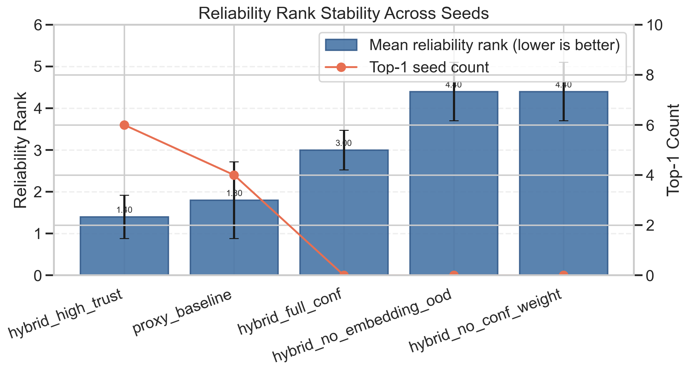
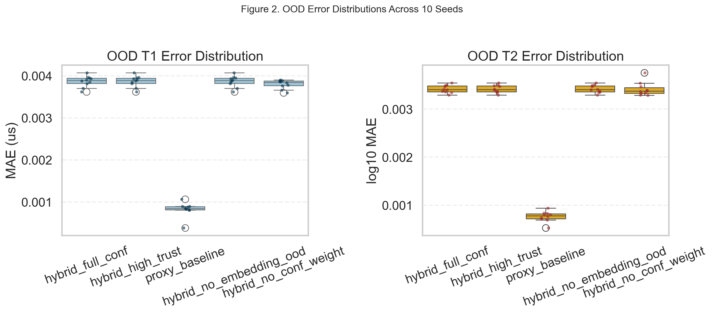
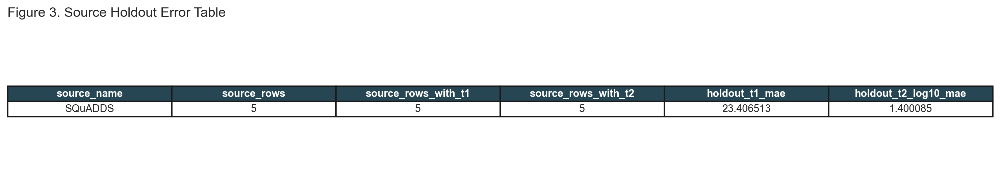
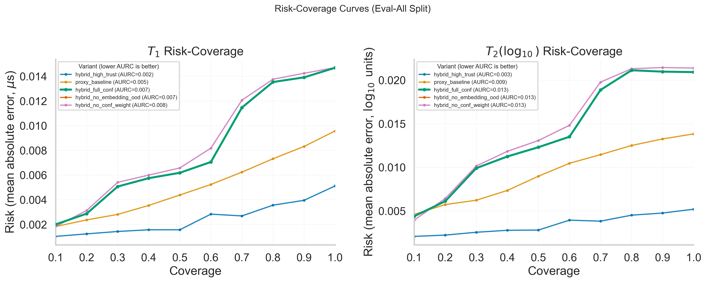
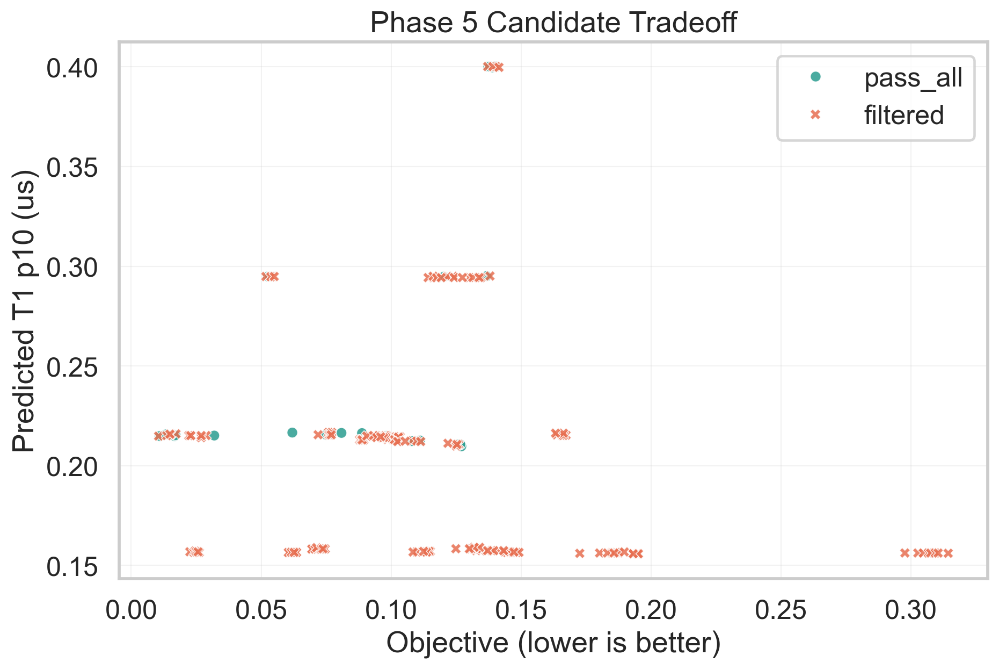
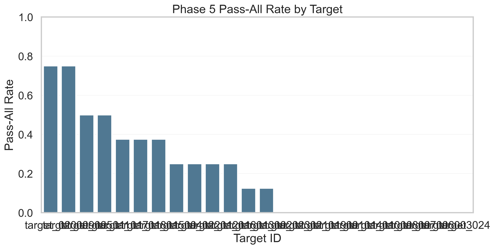
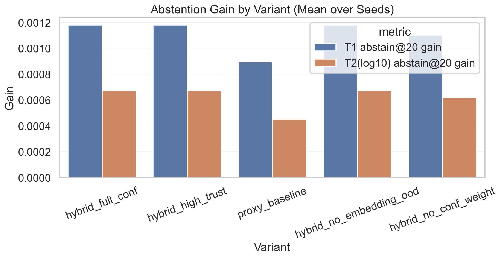
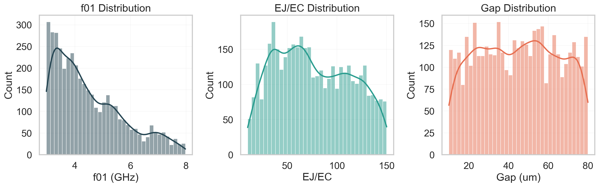

# QuForge

QuForge is an end-to-end AI pipeline for superconducting qubit design exploration, reliability-aware candidate ranking, and evidence hardening.

It combines:
- physics-driven synthetic dataset generation,
- surrogate and embedding models for inverse design,
- coherence prediction with uncertainty signals,
- closed-loop selection logic,
- reliability ablations and source-holdout evidence reporting.

## Why This Repository Exists

The goal is to make qubit design iteration faster and more systematic while being explicit about what is and is not validated.

This repository is designed for:
- research prototyping,
- pipeline benchmarking,
- candidate filtering before expensive fabrication and measurement cycles.

It is not currently claiming:
- fabrication-ready absolute coherence prediction without stronger real measured calibration.

## End-to-End Pipeline


## Repository Layout

| Path | Purpose |
|---|---|
| `Dataset/` | Data generation scripts, templates, requirements, and dataset run commands |
| `Phase1_Surrogate/` | Supervised surrogates for fast qubit/coupled-property prediction |
| `Phase2_Embedding/` | Embedding models and nearest-neighbor inverse retrieval |
| `Phase3_InverseDesign/` | Inverse design search and validation harness |
| `Phase4_Coherence/` | Coherence predictor training, validation, and measurement dataset tools |
| `Phase4_5_PublicData/` | Public data fetch, canonicalization, and conservative mapping |
| `Phase4_6_TraceCoherence/` | Trace-based augmentation pipeline |
| `Phase5_ClosedLoop/` | Closed-loop candidate scoring and fab handoff export |
| `Phase6_Reliability/` | Reliability variant comparisons and stress tests |
| `Phase7_Evidence/` | Multi-seed evidence hardening, holdout runs, figure generation, and web app |

## Current Run Snapshot (Latest Strict Rerun)

The latest strict rerun used:
- geometry enabled,
- Palace required (`--no-palace-fallback`),
- no fitted/model public curves by default in mapping.

### Data and Coverage

| Item | Value |
|---|---|
| Single-device dataset rows | `4142` |
| Coupled-device dataset rows | `80000` |
| Single dataset source | Palace-derived (`palace_cached`) |
| Unique referenced GDS | `1027` |
| Strict mapped public measured rows | `5` |
| Rejected fitted/model rows in strict map | `1240` |

### Reliability/Evidence Highlights

| Metric | Result |
|---|---|
| Phase 5 targets/candidates/selected | `24 / 192 / 30` |
| Phase 6 primary variant (single-seed summary) | `proxy_baseline` |
| Phase 7 10-seed top by mean reliability rank | `hybrid_full_conf` (`rank_mean=1.6`, `top1_count=5`) |
| Phase 7 source holdout rows used | `5` |
| Phase 7 source holdout `t1` MAE | `23.4065 us` |
| Phase 7 source holdout `t2(log10)` MAE | `1.4001` |

Interpretation:
- Internal ranking behavior is meaningful and reproducible.
- Cross-source absolute transfer remains weak with current measured-data volume.

## Visual Results

These figures are included from the latest strict large-sweep outputs.

### Rank Stability (10-seed sweep)


### OOD Error Distribution by Variant


### Source-Holdout Summary


### Risk-Coverage Curves


### Phase 5 Candidate Tradeoff


### Phase 5 Pass-Rate by Target


### Abstention Gain by Variant


### Dataset Distribution (Single Device)


## Claims and Boundaries (Honest Scope)

| Topic | Supported Now | Not Supported Yet |
|---|---|---|
| Reliability-aware ranking/filtering | Yes | N/A |
| Closed-loop shortlist generation | Yes | N/A |
| Robustness comparisons across variants | Yes | N/A |
| Absolute coherence prediction for production/fab handoff | Limited | Yes, requires substantially more measured calibration data |
| Cross-lab generalization claim | Weak evidence | Yes, needs out-of-source improvement with richer measured datasets |

## Real Data Reality

This project explicitly separates:
- what can be learned from simulation + public data bootstrapping,
- what requires real hardware measurement.

Important:
- Real measured coherence cannot be created by synthetic simulation alone.
- Publicly mined rows are sparse and heterogeneous after strict filtering.
- Current holdout behavior confirms a real transfer gap.

See:
- `Phase4_Coherence/MEASUREMENT_DATA_GUIDE.md`

## Reproducibility

### Minimal Dry Run

```powershell
Dataset\.venv310\Scripts\python -m pip install -r Dataset\requirements-dataset.txt
Dataset\.venv310\Scripts\python Dataset\generate_data.py --dry-run --workdir Dataset
```

### Full Strict Physics Generation

```powershell
Dataset\.venv310\Scripts\python Dataset\generate_data.py --workdir Dataset --sampling-mode random --geometry-samples 1200 --junction-samples 10 --target-single-rows 10000 --max-pairs 5000 --gmsh-verbosity 0 --mesh-lc-min-um 30 --mesh-lc-max-um 120 --mesh-optimize-threshold 0.45 --no-palace-fallback
```

### Full Paper Stream

Run in order:

```powershell
Dataset\.venv310\Scripts\python Dataset\generate_data.py --workdir Dataset --sampling-mode random --geometry-samples 1200 --junction-samples 10 --target-single-rows 10000 --max-pairs 5000 --gmsh-verbosity 0 --mesh-lc-min-um 30 --mesh-lc-max-um 120 --mesh-optimize-threshold 0.45 --no-palace-fallback
Dataset\.venv310\Scripts\python Phase4_5_PublicData\build_public_canonical_dataset.py
Dataset\.venv310\Scripts\python Phase4_5_PublicData\augment_large_raw_sources.py --input-csv Dataset\public_sources\silver\public_measurements_canonical.csv --output-csv Dataset\public_sources\silver\public_measurements_canonical.csv
Dataset\.venv310\Scripts\python Phase4_5_PublicData\map_public_to_internal.py --max-distance 1.6 --min-confidence 0.30
Dataset\.venv310\Scripts\python Phase1_Surrogate\train_surrogate.py --n-estimators 250 --max-depth 32
Dataset\.venv310\Scripts\python Phase2_Embedding\train_phase2_embedding_nn.py
Dataset\.venv310\Scripts\python Phase2_Embedding\validate_phase2_embedding_nn.py
Dataset\.venv310\Scripts\python Phase3_InverseDesign\validate_phase3.py --max-queries-per-split 40
Dataset\.venv310\Scripts\python Phase4_Coherence\train_phase4_coherence.py --label-mode hybrid --measurement-csv Dataset\measurement_dataset_public_bootstrap.csv --measured-weight 1.0 --proxy-weight 1.0
Dataset\.venv310\Scripts\python Phase4_Coherence\validate_phase4_coherence.py --measurement-csv Dataset\measurement_dataset_public_bootstrap.csv
Dataset\.venv310\Scripts\python Phase5_ClosedLoop\run_phase5_closed_loop.py
Dataset\.venv310\Scripts\python Phase6_Reliability\run_phase6_reliability.py
Dataset\.venv310\Scripts\python Phase7_Evidence\run_phase7_evidence.py --measurement-csv Dataset\measurement_dataset_public_bootstrap.csv --output-dir Phase7_Evidence\artifacts_large_sweep --seeds 42,123,777,1001,1002,1003,1004,1005,1006,1007
Dataset\.venv310\Scripts\python Phase7_Evidence\generate_publication_figures.py --input-dir Phase7_Evidence\artifacts_large_sweep --output-dir Phase7_Evidence\artifacts_large_sweep\figures
Dataset\.venv310\Scripts\python Phase7_Evidence\generate_extended_publication_figures.py --phase7-dir Phase7_Evidence\artifacts_large_sweep --phase6-dir Phase6_Reliability\artifacts --phase5-dir Phase5_ClosedLoop\artifacts --single-csv Dataset\final_dataset_single.csv --output-dir Phase7_Evidence\artifacts_large_sweep\figures
```

## Environment Notes

- Python environment used in this project: `Dataset/.venv310`.
- Docker is required for Palace-based strict generation.
- WSL + Docker Desktop works for large sweeps.
- Generated runtime artifacts are intentionally git-ignored.

## Collaboration Request: Real Lab Measurement Data

We are actively looking for collaboration with labs, and with individual researchers/engineers affiliated with labs, to improve real-world calibration and transfer.

### What We Need

Minimum schema per measured sample:

| Field | Required | Notes |
|---|---|---|
| `row_index` or `design_id` | Yes | Must map to `Dataset/final_dataset_single.csv` |
| `measured_t1_us` | Yes | Real measured T1 in microseconds |
| `measured_t2_us` | Yes | Real measured T2 in microseconds |
| `measured_freq_01_GHz` | Optional | Measured transition frequency |
| `measured_anharmonicity_GHz` | Optional | Measured anharmonicity |
| `source_name` | Strongly recommended | Lab/system identifier for source-aware calibration |
| `chip_id`, `cooldown_id`, `measurement_date_utc`, `notes` | Optional | Useful for drift and provenance analysis |

For details:
- `Dataset/measurement_raw.template.csv`
- `Dataset/measurement_dataset.template.csv`
- `Phase4_Coherence/MEASUREMENT_DATA_GUIDE.md`

### Collaboration Modes

- Public contribution of de-identified CSVs.
- Private collaboration under data use terms, with aggregate-only reporting.
- Joint benchmark setup with fixed train/holdout protocols.

### How to Reach Out

- Email: `yousuf.tomal.0@gmail.com`
- Required subject line: `QuForge Collaboration - Real Measured Qubit Data - <Lab/Institution>`
- In the email body, include:
1. data availability (approximate row count and fields),
2. measurement stack (device family, readout pipeline, cooldown context),
3. preferred collaboration mode (public, private, or joint benchmark).

## License

Apache License 2.0. See `LICENSE`.
